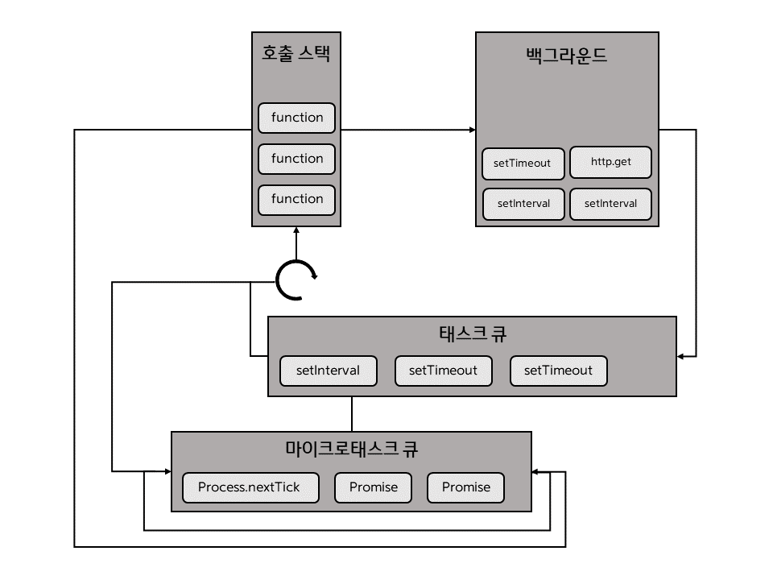

- [3.1 REPL 사용하기](#31-repl-사용하기)
- [3.2 JS 파일 실행하기](#32-js-파일-실행하기)
- [3.3 모듈로 만들기](#33-모듈로-만들기)
- [3.4 노드 내장 객체 알아보기](#34-노드-내장-객체-알아보기)
  - [3.4.1 global](#341-global)
  - [3.4.2 console](#342-console)
  - [3.4.3 타이머](#343-타이머)
  - [3.4.4 __filename, __dirname](#344-__filename-__dirname)
  - [3.4.5 module, exports, require](#345-module-exports-require)
  - [3.4.6 process](#346-process)
    - [3.4.6.1 `process.env`](#3461-processenv)
    - [3.4.6.2 process.nextTick(콜백)](#3462-processnexttick콜백)
    - [3.4.6.3 process.exit(코드)](#3463-processexit코드)
- [3.5 노드 내장 모듈 사용하기](#35-노드-내장-모듈-사용하기)
  - [3.5.1 os](#351-os)
  - [3.5.2 path](#352-path)
  - [3.5.3 url](#353-url)
  - [3.5.4 querystring](#354-querystring)
  - [3.5.5 crypto](#355-crypto)
    - [3.5.5.1 단방향 암호화](#3551-단방향-암호화)
    - [3.5.5.2 양방향 암호화](#3552-양방향-암호화)
  - [3.5.6 util](#356-util)
  - [3.5.7 worker_threads](#357-worker_threads)
  - [3.5.8 child_process](#358-child_process)
  - [3.5.9](#359)
- [3.6 파일 시스템 접근하기](#36-파일-시스템-접근하기)
  - [3.6.1 동기 메서드와 비동기 메서드](#361-동기-메서드와-비동기-메서드)
  - [3.6.2 버퍼와 스트림 이해하기](#362-버퍼와-스트림-이해하기)
  - [3.6.3 기타 fs 메서드 알아보기](#363-기타-fs-메서드-알아보기)
  - [3.6.4 스레드풀 알아보기](#364-스레드풀-알아보기)
- [3.7 이벤트 이해하기](#37-이벤트-이해하기)
- [3.8 예외 처리하기](#38-예외-처리하기)
  - [3.8.1 자주 발생하는 에러들](#381-자주-발생하는-에러들)

# 3.1 REPL 사용하기

노드도 자바스크립트의 브라우저 콘솔과 같은 콘솔을 제공하는데, 입력한 코드를 **읽고(Read)**, **해석하고(Eval)**, **결과물을 반환하고(Print)**, **종료할 때까지 반복한다(Loop)**고 해서 **REPL(Read Eval Print Loop)** 이라고 부릅니다.

콘솔창에 node를 입력하면 노드의 REPL를 사용할 수 있습니다.

```
$ node
>
```

프롬프트가 > 로 바뀌었다면 자바스크립트 코드를 입력할 수 있습니다.

```
> const str = 'Hello world, hello node';
undefined
> console.log(str);
Hello world, hello node
undefined
>
```

REPL을 종료하려면 ctrl+c를 두 번 누르거나 REPL 창에 .exit을 입력하면 됩니다.

REPL은 한두 줄짜리 코드를 테스트해보는 용도로는 좋지만 여러 줄의 코드를 실행하기에는 불편합니다. 긴 코드인 경우에는 코드를 자바스크립트 파일로 만든 후 파일을 통째로 실행하는 것이 좋습니다.

# 3.2 JS 파일 실행하기

```js
function helloWorld() {
    console.log('Hello World');
    helloNode();
}

function helloNode() {
    console.log('Hello Node');
}

helloWorld();
```

콘솔에서 node [자바스크립트 파일 경로]로 실행합니다. 확장자(.js)는 생략해도 됩니다. REPL에서 입력하는 것이 아니므로 주의하세요. REPL이 아니라 콘솔에서 입력해야 합니다. 콘솔에서 REPL로 들어가는 명령어가 node고, 노드를 통해 파일을 실행하는 명령어는 node [자바스크립트 파일 경로]입니다.

```
$ node helloWorld
Hello World
Hello Node
```

# 3.3 모듈로 만들기

노드는 코드를 모듈로 만들 수 있다는 점에서 브라우저의 자바스크립트와 다릅니다. **모듈**이란 특정한 기능을 하는 함수나 변수들의 집합입니다. 모듈은 자체로도 하나의 프로그램이면서 다른 프로그램의 부품으로도 사용할 수 있습니다.

**모듈로 만들어두면 여러 프로그램에 해당 모듈을 재사용할 수 있습니다.** 자바스크립트에서 코드를 재사용하기 위해 함수로 만드는 것과 비슷합니다.

**보통 파일 하나가 모듈이 됩니다.**

모듈을 만들 때는 모듈이 될 파일과 모듈을 불러와서 사용할 파일이 필요합니다. var.js와 func.js, index.js를 같은 폴더에서 만들어봅니다.

```js
const odd = '홀수입니다';
const even = '짝수입니다';

module.exports = {
    odd,
    even
}
```
var.js에 변수 두 개를 선언하고 module.exports에 변수들을 담은 객체를 대입했습니다. 이제 모듈로서 기능합니다. 다른 파일에서 해당 모듈을 불러오면 module.exports에 대입된 값을 사용할 수 있습니다.

```js
const { odd, even } = require('./var');

function checkOddOrEven(num) {
    if (num % 2) {  // 홀수면
        return odd;
    }
    return even;
}

module.exports = checkOddOrEven;
```

**require** 함수 안에 불러올 모듈의 경로를 적습니다. 파일 경로에서 js나 json 같은 확장자는 생략 가능합니다.

var.js에서 변수를 불러온 뒤, 숫자의 홀짝을 판별하는 함수를 선언했습니다. 그리고 다시 module.exports에 함수를 대입했습니다. 그런데 module.exports에는 객체뿐만 아니라 함수나 변수 등을 대입할 수도 있습니다.

```js
const { odd, even } = require('./var');
const checkNumber = require('./func');

function checkStringOddOrEven(str) {
    if (str.length % 2) { // 홀수면
        return odd;
    }
    return even
}

console.log(checkNumber(10));
console.log(checkStringOddOrEven('hello'));
```

index.js는 var.js와 func.js를 모두 참조합니다. 모듈로부터 값을 불러올 때 변수 이름을 다르게 지정할 수도 있습니다.

```
$ node index
짝수입니다
홀수입니다
```

여러 파일에 걸쳐 재사용되는 함수나 변수를 모듈로 만들어두면 편리하지만, 모듈이 많아지고 모듈 간의 관계가 얽히게 되면 구조를 파악하기 어렵습니다. 노드에서는 대부분의 파일이 다른 파일을 모듈로 사용하고 있으므로 모듈을 만들고 사용하는 방법을 꼭 알아두어야 합니다.

방금 살펴본 require 함수나 module 객체는 노드에서 기본적으로 제공하는 내장 객체이기 때문에 바로 사용이 가능했습니다.

# 3.4 노드 내장 객체 알아보기

노드는 기본적인 내장 객체와 내장 모듈을 제공합니다.

## 3.4.1 global

브라우저의 window와 같은 전역 객체입니다. window처럼 global도 생략할 수 있습니다. require 함수도 원래는 global.require이며, console객체도 global.console입니다.

전역 객체라는 점을 이용하여 파일 간에 간단한 데이터를 공유할 때 사용하기도 합니다. globalA.js와 globalB.js를 만들어 봅시다.

```js
module.exports = () => global.message;
```
```js
const A = require('./globalA');

global.message = '안녕하세요';
console.log(A());
```
globalA 모듈의 함수는 global.message 값을 반환하며, globalB.js는 global 객체에 속성명이 message인 값을 대입하고 globalA 모듈의 함수를 호출합니다. 콘솔 결과는 globalB에서 넣은 global.message 값을 globalA에서도 접근할 수 있음을 보여줍니다.

```
$ node globalB
안녕하세요
```

## 3.4.2 console

console 객체도 window 대신 global 객체 안에 들어있습니다. **주로 디버깅을 위해 사용합니다.** 개발하면서 변수에 값이 제대로 들어 있는지 확인하기 위해 사용하고, 에러 발생 시 에러 내용을 콘솔에 표시하기 위해 사용하며, 코드 실행 시간을 알아보려고 할 때도 사용합니다.

```js
const string = 'abc';
const number = 1;
const boolean = true;
const obj = {
    outside: {
        inside: {
            key: 'value',
        },
    },
};
console.time('전체 시간');
console.log('평범한 로그입니다 쉼표로 구분해 여러 값을 찍을 수 있습니다.');
console.log(string, number, boolean);
console.error('에러 메시지는 console.error에 담아주세요');

console.table([{ name: '제로', birth: 1994 }, { name: 'hero', birth: 1988 }]);

console.dir(obj, { colors: false, depth: 2 });
console.dir(obj, { colors: true, depth: 1 });

console.time('시간 측정');
for (let i = 0; i < 100000; i++) {}
console.timeEnd('시간 측정');

function b() {
    console.trace('에러 위치 추적');
}
function a() {
    b();
}
a();

console.timeEnd('전체 시간');
```
* console.time(레이블): console.timeEnd(레이블)고 대응되어 같은 레이블을 가진 time과 timeEnd 사이의 시간을 측정합니다.
* console.log(내용): 평범한 로그를 콘솔에 표시합니다. console(내용, 내용, ...)처럼 여러 내용을 동시에 표시할 수도 있습니다(값 사이에 띄어쓰기되어 출력됨).
* console.error(에러 내용): 에러를 콘솔에 표시합니다.
* console.table(배열): 배열의 요소로 객체 리터럴을 넣으면, 객체의 속성들이 테이블 형식으로 표현됩니다.
* console.dir(객체, 옵션): 객체를 콘솔에 표시할 때 사용합니다. 옵션의 colors를 true로 하면 콘솔에 색이 추가되어 가독성이 좋습니다. depth는 객체 안의 객체를 몇 단계까지 보여줄지를 결정합니다. 기본 값은 2입니다.
* console.trace(레이블): 에러가 어디서 발생했는지 추적할 수 있게 합니다. 위치를 알려주므로 자주 사용하지는 않습니다.

```
$ node console
평범한 로그입니다 쉼표로 구분해 여러 값을 찍을 수 있습니다.
abc 1 true
에러 메시지는 console.error에 담아주세요
┌─────────┬────────┬───────┐
│ (index) │  name  │ birth │
├─────────┼────────┼───────┤
│    0    │ '제로' │ 1994  │
│    1    │ 'hero' │ 1988  │
└─────────┴────────┴───────┘
{ outside: { inside: { key: 'value' } } }
{ outside: { inside: [Object] } }
시간 측정: 1.703ms
Trace: 에러 위치 추적
    at b (C:\Users\stae1\workspace\NodeJS\ch3\console.js:26:13)
    at a (C:\Users\stae1\workspace\NodeJS\ch3\console.js:29:5)
    at Object.<anonymous> (C:\Users\stae1\workspace\NodeJS\ch3\console.js:31:1)
전체 시간: 14.787ms
```

## 3.4.3 타이머

setTimeout, setInterval, setImmediate는 노드에서 window 대신 global 객체 안에 들어 있습니다.

* setTimeout(콜백 함수, 밀리초): 주어진 밀리초(1,000분의 1초) 이후에 콜백 함수를 실행합니다.
* setInterval(콜백 함수, 밀리초): 주어진 밀리초마다 콜백 함수를 반복 실행합니다.
* setImmediate(콜백 함수): 콜백 함수를 즉시 실행합니다.

이 타이머 함수들은 모두 **아이디를 반환**합니다. 아이디를 사용하여 타이머를 취소할 수 있습니다.

* clearTimeout(아이디): setTimeout을 취소합니다.
* clearInterval(아이디): setInterval을 취소합니다.
* clearImmediate(아이디): setImmediate를 취소합니다.

```js
const timeout = setTimeout(() => {
    console.log('1.5초 후 실행');
}, 1500);

const interval = setInterval(() => {
    console.log('1초마다 실행');
}, 1000);

const timeout2 = setTimeout(() => {
    console.log('실행되지 않습니다');
}, 3000);

setTimeout(() => {
    clearTimeout(timeout2);
    clearInterval(interval);
}, 2500);

const immediate = setImmediate(() => {
    console.log('즉시 실행');
});

const immediate2 = setImmediate(() => {
    console.log('실행되지 않습니다');
});

clearImmediate(immediate2);
```

제일 먼저 실행되는 것은 immediate이며, immediate2는 clearImmediate로 인해 바로 취소됩니다. 그 이후 interval이 실행되고. timeout이 실행된 후에 interval이 다시 실행되고 2.5초가 지났기 때문에 timeout2와 interval이 취소됩니다.

```
$ node timer
즉시 실행
1초마다 실행
1.5초후 실행
1초마다 실행
```

## 3.4.4 __filename, __dirname

노드에서는 파일 사이에 모듈 관계가 있는 경우가 많으므로 때로는 현재 파일의 경로나 피일명을 알아야 합니다. 노드는 __filename, __dirname이라는 키워드로 경로에 대한 정보를 제공합니다. 파일에 __filename과 __dirname을 넣어두면 실행 시 현재 파일명과 현재 파일 경로로 바뀝니다.

```js
console.log(__filename);
console.log(__dirname);
```
```
$ node filename
C:\Users\stae1\workspace\NodeJS\ch3\filename.js
C:\Users\stae1\workspace\NodeJS\ch3
```

윈도가 아니라면 \ 대신 /로 폴더 경로가 구분될 수 있습니다. 이렇게 얻은 정보를 사용해서 경로 처리를 할 수도 있습니다. 하지만 경로가 문자열로 반환되기도 하고, \나 /같은 구분자 문제도 있으므로 보통은 이를 해결해주는 **path 모듈과 함께 씁니다.**

## 3.4.5 module, exports, require

모듈을 만들 때 module.exports만 사용했는데, module 객체 말고 exports 객체로도 모듈을 만들 수 있습니다.

```js
exports.odd = '홀수입니다';
exports.even = '짝수입니다';
```
```
$ node index
짝수입니다
홀수입니다
```
module.exports로 한 번에 대입하는 대신, **각각의 변수를 exports 객체에 하나씩 넣었습니다.** 동일하게 동작하는 이유는 *module.exports와 exports가 같은 객체를 참조하기 때문입니다.* (`console.log(module.exports === exports)`의 출력은 true) 따라서 exports 객체에 add 함수를 넣으면 module.exports에도 add 함수가 들어갑니다.

> exports 객체를 사용할 때 module.exports와의 참조 관계가 깨지지 않도록 주의해야 합니다. exports에는 반드시 객체처럼 속성명과 속성값을 대입해야 합니다. exports에 다른 값을 대입하면 객체의 참조 관계가 끊겨 더 이상 모듈로 기능하지 않습니다.  
> exports를 사용할 때는 **객체**만 사용할 수 있으므로 func.js와 같이 함수를 대입한 경우에는 exports로 바꿀 수 없습니다.  
> exports와 module.exports에는 참조 관계가 있으므로 한 모듈에 exports 객체와 module.exports를 동시에 사용하지 않는 것이 좋습니다.

* 노드에서의 this

```js
console.log(this);
console.log(this === module.exports);
console.log(this === exports);

function whatIsThis() {
    console.log('function', this === exports, this === global);
}
whatIsThis();
```
```
$ node this
{}
true
true
function false true
```

최상위 스코프에 존재하는 this는 module.exports(또는 exports 객체)를 가리킵니다. 또한, 함수 선언문 내부의 this는 global 객체를 가리킵니다.

require는 함수이고, 함수는 객체이므로 require는 객체로서 몇 가지 속성을 갖고 있습니다. 그중에서 require.cache와 require.main에 대해서 알아보겠습니다.

```js
console.log('require가 가장 위에 오지 않아도 됩니다.');

module.exports = '저를 찾아보세요.';

require('./var');

console.log('require.cache입니다.');
console.log(require.cache);
console.log('require.main입니다.');
console.log(require.main === module);
console.log(require.main.filename);
```
```
$ node require
require가 가장 위에 오지 않아도 됩니다.
require.cache입니다.
[Object: null prototype] {
  'C:\\Users\\stae1\\workspace\\NodeJS\\ch3\\require.js': Module {
    id: '.',
    path: 'C:\\Users\\stae1\\workspace\\NodeJS\\ch3',
    exports: '저를 찾아보세요.',
    filename: 'C:\\Users\\stae1\\workspace\\NodeJS\\ch3\\require.js',
    loaded: false,
    children: [ [Module] ],
    paths: [
      'C:\\Users\\stae1\\workspace\\NodeJS\\ch3\\node_modules',
      'C:\\Users\\stae1\\workspace\\NodeJS\\node_modules',
      'C:\\Users\\stae1\\workspace\\node_modules',
      'C:\\Users\\stae1\\node_modules',
      'C:\\Users\\node_modules',
      'C:\\node_modules'
    ]
  },
  'C:\\Users\\stae1\\workspace\\NodeJS\\ch3\\var.js': Module {
    id: 'C:\\Users\\stae1\\workspace\\NodeJS\\ch3\\var.js',
    path: 'C:\\Users\\stae1\\workspace\\NodeJS\\ch3',
    exports: { odd: '홀수입니다', even: '짝수입니다' },
    filename: 'C:\\Users\\stae1\\workspace\\NodeJS\\ch3\\var.js',
    loaded: true,
    children: [],
    paths: [
      'C:\\Users\\stae1\\workspace\\NodeJS\\ch3\\node_modules',
      'C:\\Users\\stae1\\workspace\\NodeJS\\node_modules',
      'C:\\Users\\stae1\\workspace\\node_modules',
      'C:\\Users\\stae1\\node_modules',
      'C:\\Users\\node_modules',
      'C:\\node_modules'
    ]
  }
}
require.main입니다.
true
C:\Users\stae1\workspace\NodeJS\ch3\require.js
```

require가 반드시 파일 최상단에 위치할 필요가 없고, module.exports도 최하단에 위치할 필요가 없습니다.

require.cache 객체에 require.js나 var.js 같은 파일 이름이 속성명으로 들어있는데, 속성값으로는 **각 파일의 모듈 객체**가 들어 있습니다. 한 번 require한 파일은 require.cache에 저장되므로 다음 번에 require할 때는 새로 불러오지 않고 require.cache에 있는 것이 재사용됩니다.

**만약 새로 require하길 원한다면, require.cache의 속성을 제거하면 됩니다.** 다만, 프로그램의 동작이 꼬일 수 있으니 권장하지 않습니다. 

require은 노드 실행 시 첫 모듈을 가리킵니다. 현재 node require로 실행했으므로 require.js가 require.main이 됩니다. require.main 객체의 모양은 require.cache의 모듈 객체와 같습니다. 현재 파일이 첫 모듈인지 알아보려면 `require.main === module`을 해보면 됩니다. node require로 실행한 경우, var.js에서 `require.main === module`을 실행하면 false가 반환될 것입니다. 첫 모듈의 이름을 알아보려면 `require.main.filename`으로 확인하면 됩니다.

만약 두 모듈 dep1과 dep2가 있고 이 둘이 서로를 require한다면 어떻게 될까요?

```js
const dep2 = require('./dep2');
console.log('require dep2', dep2);
module.exports = () => {
    console.log('dep2', dep2);
};
```
```js
const dep1 = require('./dep1');
console.log('require dep1', dep1);
module.exports = () => {
    console.log('dep1', dep1);
};
```
```js
const dep1 = require('./dep1');
const dep2 = require('./dep2');
dep1();
dep2();
```
코드가 위에서부터 실행되므로 require('./dep1')이 먼저 실행됩니다. dep1.js에서는 제일 먼저 require('./dep2')가 실행되는데, dep2.js에서는 require('./dep1')이 실행됩니다. 

```
$ node dep-run
require dep1 {}
require dep2 [Function (anonymous)]
dep2 [Function (anonymous)]
dep1 {}
(node:16600) Warning: Accessing non-existent property 'Symbol(nodejs.util.inspect.custom)' of module exports inside circular dependency
(Use `node --trace-warnings ...` to show where the warning was created)
(node:16600) Warning: Accessing non-existent property 'constructor' of module exports inside circular dependency
(node:16600) Warning: Accessing non-existent property 'Symbol(Symbol.toStringTag)' of module exports inside circular dependency
(node:16600) Warning: Accessing non-existent property 'Symbol(Symbol.iterator)' of module exports inside circular dependency
(node:16600) Warning: Accessing non-existent property 'Symbol(nodejs.util.inspect.custom)' of module exports inside circular dependency
(node:16600) Warning: Accessing non-existent property 'constructor' of module exports inside circular dependency
(node:16600) Warning: Accessing non-existent property 'Symbol(Symbol.toStringTag)' of module exports inside circular dependency
(node:16600) Warning: Accessing non-existent property 'Symbol(Symbol.iterator)' of module exports inside circular dependency
```
dep1의 module.exports가 함수가 아니라 빈 객체로 표시됩니다. 이러한 현상을 **순환 참조(circular dependency)** 라고 부릅니다. 이렇게 순환 참조가 있을 경우에는 순환 참조되는 대상을 빈 객체로 만듭니다. 이때 에러가 발생하지 않고 조용히 빈 객체로 변경되므로 예기치 못한 동작이 발생할 수 있습니다. 따라서 순환 참조가 발생하지 않도록 구조를 잘 잡는 것이 중요합니다.

## 3.4.6 process

process 객체는 **현재 실행되고 있는 노드 프로세스에 대한 정보**를 담고 있습니다. process 객체 안에는 다양한 속성이 있는데, 하나씩 REPL에 따라 입력해봅시다.

```
> process.version
'v16.14.0' // 설치된 노드의 버전입니다.
> process.arch
'x64' // 프로세스 아키텍처 정보입니다.
> process.platform
'win32' // 운영체제 플랫폼 정보입니다
> process.pid
18996 // 현재 프로세스 아이디입니다. 프로세스를 여러 개 가질 때 구분할 수 있습니다.
> process.uptime()
41.8934884 // 프로세스가 시작된 후 흐른 시간입니다. 단위는 초입니다.
> process.execPath
'C:\\Program Files\\nodejs\\node.exe' // 노드의 경로입니다.
> process.cwd()
'C:\\Users\\stae1\\workspace\\NodeJS' // 현재 프로세스가 실행되는 위치입니다.
> process.cpuUsage()
{ user: 406000, system: 281000 } // 현재 cpu 사용량입니다.
```

### 3.4.6.1 `process.env`

REPL에 precess.env를 입력하면 매우 많은 정보가 출력됩니다. 자세히 보면 이 정보들이 시스템의 환경 변수임을 알 수 있습니다. 시스템 환경 변수는 노드에 직접 영향을 미치기도 합니다. 대표적인 것으로 **UV_THREADPOOL_SIZE**와 **NODE_OPTIONS**가 있습니다.

```
NODE_OPTIONS=--max-old-space-size=8192
UV_THREADPOOL_SIZE=8
```
NODE_OPTIONS: 노드를 실행할 때 옵션들을 입력받는 환경 변수(--max-old-space-size=8192 => 노드의 메모리를 8GB까지 사용)  
UV_THREADPOOL_SIZE: 노드에서 기본적으로 사용하는 스레드풀의 스레드 개수를 조절

process.env는 서비스의 중요한 키를 저장하는 공간으로도 사용되기 때문에 서버나 데이터베이스의 비밀번호와 각종 API 키를 코드에 입력하는 것은 위험
```js
const secretId = process.env.SECRET_ID;
const secretCode = process.env.SECRET_CODE;
```
중요한 데이터는 다음과 같이 속성으로 대체

### 3.4.6.2 process.nextTick(콜백)

이벤트 루프가 다른 콜백 함수들보다 nextTick의 콜백 함수를 우선으로 처리하도록 함

```js
setImmediate(() => {
    console.log('immediate');
});
process.nextTick(() => {
    console.log('nextTick');
});
setTimeout(() => {
    console.log('timeout');
}, 0);
Promise.resolve().then(() => console.log('promise'));
```
```
$ node nextTick
nextTick
promise
timeout
immediate
```
process.nextTick은 setImmediate와 setTimeout보다 먼저 실행. 코드 맨 밑에 Promise를 넣은 것은 resolve된 Promise도 nextTick처럼 다른 콜백보다 우선시되기 때문.

**process.nextTick과 Promise를 *마이크로 태스크(microtask)* 라고 따로 구분지어 부름**

(직접 제작)

> 이벤트 루프에서 대기하는 콜백 함수보다 먼저 실행되기 때문에 setImmediate보다 process.nextTick을 더 선호하는 개발자도 있는데, 마이크로태스크를 재귀 호출하게 되면 이벤트 루프는 다른 콜백 함수보다 마이크로태크스를 우선하여 처리하므로 콜백 함수들이 실행되지 않을 수도 있음.

### 3.4.6.3 process.exit(코드)

실행중인 노드 프로세스를 종료한다. 서버 환경에서 사용하면 서버가 멈추기에 서버에서 잘 사용하지 않는다. 서버 외 독립적인 프로그램에서는 수동으로 노드를 멈추기 위해 사용한다.

```js
let i = 1;
setInterval(() => {
    if (i === 5) {
        console.log('종료!');
        process.exit();
    }
    console.log(i);
    i += 1;
}, 1000);
```
```
$ node exit
1
2
3
4
종료!
```

process.exit 메서드는 인수로 코드번호를 줄 수 있다. 인수를 주지 않거나 0을 입력하면 정상 종료, 1을 입력하면 비정상 종료를 뜻한다. 에러가 발생해서 종료하는 경우에는 1을 넣으면 된다.

# 3.5 노드 내장 모듈 사용하기

## 3.5.1 os

노드는 os 모듈에 운영체제의 정보를 담고 있어 정보를 가져올 수 있다.

```js
const os = require('os');

console.log('운영체제 정보------------------------------');
console.log('os.arch():', os.arch());
console.log('os.platform():', os.platform());
console.log('os.type():', os.type());
console.log('os.uptime():', os.uptime());
console.log('os.hostname():', os.hostname());
console.log('os.release():', os.release());

console.log('경로---------------------------------------');
console.log('os.homedir():', os.homedir());
console.log('os.tmpdir():', os.tmpdir());

console.log('cpu 정보-----------------------------------');
console.log('os.cpus():', os.cpus());
console.log('os.cpus().length', os.cpus().length);

console.log('메모리 정보--------------------------------');
console.log('os.freemem():', os.freemem());
console.log('os.totalmem():', os.totalmem());
```
```
운영체제 정보------------------------------
os.arch(): x64
os.platform(): win32
os.type(): Windows_NT
os.uptime(): 352272
os.hostname(): DESKTOP-A8S2FSG
os.release(): 10.0.19044
경로---------------------------------------
os.homedir(): C:\Users\stae1
os.tmpdir(): C:\Users\stae1\AppData\Local\Temp
cpu 정보-----------------------------------
os.cpus(): [
  {
    model: 'AMD Ryzen 7 4700U with Radeon Graphics         ',
    speed: 1996,
    times: {
    // 생략
]
os.cpus().length 8
메모리 정보--------------------------------
os.freemem(): 8574967808
os.totalmem(): 16505954304
```
* os.arch(): process.arch와 동일
* os.platform: process.platform과 동일
* os.type(): 운영체제의 종류를 보여줌
* os.uptime(): 운영체제 부팅 이후 흐른 시간(초)를 보여줌. process.uptime()은 노드의 실행시간
* os.hostname(): 컴퓨터의 이름을 보여줌
* os.release(): 운영체제의 버전을 보여줌
* os.homedir(): 홈 디렉터리 경로를 보여줌
* os.tmpdir(): 임시 파일 저장 경로를 보여줌
* os.cpus(): 컴퓨터의 코어 정보를 보여줌
* os.freemem(): 사용 가능한 메모리(RAM)를 보여줌
* os.totalmem(): 전체 메모리 용량을 보여줌

## 3.5.2 path

폴더와 파일의 경로를 쉽게 조작하도록 도와주는 모듈. path 모듈은 운영체제별로 경로 구분자가 다르기 떄문에 필요하다. 크게 윈도 타입과 POSIX 타입으로 구분된다. POSIX는 유닉스 기반의 운영체제들을 의미하며 맥과 리눅스가 속한다.
* 윈도: C:\Users\stae1처럼 \로 구분
* POSIX: /home/stae1처럼 /로 구분

```js
const path = require('path');

const string = __filename;

console.log('path.sep:', path.sep);
console.log('path.delimiter:', path.delimiter);
console.log('------------------------------');
console.log('path.dirname():', path.dirname(string));
console.log('path.extname():', path.extname(string));
console.log('path.basename():', path.basename(string));
console.log('path.basename - extname:', path.basename(string, path.extname(string)));
console.log('------------------------------');
console.log('path.parse():', path.parse(string));
console.log('path.format():', path.format({
    dir: 'C:\\users\\stae1',
    name: 'path',
    ext: '.js',
}));
console.log('path.normalize():', path.normalize('C://users\\\\stae1\\\path.js'));
console.log('------------------------------');
console.log('path.isAbsolute(C:\\):', path.isAbsolute('C:\\'));
console.log('path.isAbsolute(./home):', path.isAbsolute('./home'));
console.log('------------------------------');
console.log('path.relative():', path.relative('C:\\users\\stae1\\path.js', 'C:\\'));
console.log('path.join():', path.join(__dirname, '..', '..', '../users', '.', '/stae1'));
console.log('path.resolve():', path.resolve(__dirname, '..', 'users', '.', '/stae1'));
```
```
path.sep: \
path.delimiter: ;
------------------------------
path.dirname(): C:\Users\stae1\workspace\NodeJS\ch3
path.extname(): .js
path.basename(): path.js
path.basename - extname: path
------------------------------
path.parse(): {
  root: 'C:\\',
  dir: 'C:\\Users\\stae1\\workspace\\NodeJS\\ch3',
  base: 'path.js',
  ext: '.js',
  name: 'path'
}
path.format(): C:\users\stae1\path.js
path.normalize(): C:\users\stae1\path.js
------------------------------
path.isAbsolute(C:\): true
path.isAbsolute(./home): false
------------------------------
path.relative(): ..\..\..
path.join(): C:\Users\stae1\users\stae1
path.resolve(): C:\stae1
```
* path.sep: 경로의 구분자. 윈도는 \, POSIX는 /
* path.delimiter: 환경 변수의 구부자. process.env.PATH를 입력하면 여러 개의 경로가 구분자로 구분. 윈도는 세미콜론(;), POSIX는 콜론(:)
* path.dirname(경로): 파일이 위치한 폴더 경로를 보여줌
* path.dirname(경로): 파일의 확장자를 보여줌
* path.basename(경로, 확장자): 파일의 이름(확장자 포함)을 표시. 파일의 이름만 표시하고 싶다면 basename의 두 번째 인수로 파일의 확장자를 넣는다.
* path.parse(경로): 파일 경로를 root, dir, base, ext, name으로 분리
* path.format(객체): path.parse()한 객체를 파일 경로로 합칩니다.
* path.normalize(경로): /나 \를 실수로 여러 번 사용했거나 혼용했을 때 정상적인 경로로 변환
* path.isAbsolute(경로): 파일의 경로가 절대 경로인지 상대경로인지를 true나 false로 알림
* path.relative(기준경로, 비교경로): 경로를 두 개 넣으면 첫 번째 경로에서 두 번째 경로로 가는 방법을 알려줌
* path.join(경로, ···): 여러 인수를 넣으면 하나의 경로로 합침. 상대경로인 ..(부모 디렉터리)과 .(현 위치)도 알아서 처리
* path.resolve(경로): /를 만나면 path.resolve는 절대 경로로 인식해서 앞의 경로를 무시하고, path.join은 상대경로로 처리한다.
  
```js
path.join('/a', '/b', '/c'); /* 결과: /a/b/c/ */
path.resolve('/a', '/b', 'c'); /* 결과: /b/c */
```

기본적으로 경로는 \ 하나를 사용해서 표시하는데, 자바스크립트 문자열에서는 \가 특수 문자이므로 \를 두 개 붙여 경로를 표시해야 한다. path 모듈은 위와 같은 경우에 발생하는 문제를 알아서 처리하므로, 윈도에서 path 모듈이 꼭 필요하다.

* 상대경로와 절대경로

절대 경로는 루트 폴더(윈도 C:\ 혹은 POSIX의 /)나 노드 프로세스가 실행되는 위치가 기준이 되며, 상대 경로는 현재 파일이 기준이 된다.

윈도에서 POSIX 스타일 경로를 사용하거나 혹은 그 반대상황이 생길 때는 윈도에서는 `path.posix.sep`이나 `path.posix.join()`과 같이 사용하면 되고, POSIX에서는 `path.win32.sep`이나 `path.win32.join()`과 같이 사용하면 된다.

노드는 require.main 파일을 기준으로 상대 경로를 인식한다. 이때, require.main과는 다른 디렉터리의 파일이 상대 경로를 갖고 있다면 예상과 다르게 동작할 수 있다. **이 문제는 path 모듈을 통해 해결할 수 있다.**

## 3.5.3 url

인터넷 주소를 쉽게 조작하도록 도와주는 모듈.

<url 처리 방식>
* WHATWG(웹 표준을 정하는 단체의 이름) 방식의 url
* 예전부터 노드에서 사용하던 방식의 url

```js
const url = require('url');

const { URL } = url;
const myURL = new URL('http://www.gilbut.co.kr/book/bookList.aspx?sercate1=001001000#anchor');
console.log('new URL():', myURL);
console.log('url.format():', url.format(myURL));
console.log('-------------------------------');
const parsedUrl = url.parse('http://www.gilbut.co.kr/book/bookList.aspx?sercate1=001001000#anchor')
console.log('url.parse():', parsedUrl);
console.log('url.format():', url.format(parsedUrl));
```
url 모듈 안에 URL 생성자가 있고 이 생성자에 주소를 넣어 객체로 만들면 부분별로 정리가 완료된다. 이 방식이 **WAHTWG의 url**이다. WHATWG에만 있는 username, password, origin, searchParams 속성이 존재

```
$ node url
new URL(): URL {
  href: 'http://www.gilbut.co.kr/book/bookList.aspx?sercate1=001001000#anchor',
  origin: 'http://www.gilbut.co.kr',
  protocol: 'http:',
  username: '',
  password: '',
  host: 'www.gilbut.co.kr',
  hostname: 'www.gilbut.co.kr',
  port: '',
  pathname: '/book/bookList.aspx',
  search: '?sercate1=001001000',
  searchParams: URLSearchParams { 'sercate1' => '001001000' },
  hash: '#anchor'
}
url.format(): http://www.gilbut.co.kr/book/bookList.aspx?sercate1=001001000#anchor
-------------------------------
url.parse(): Url {
  protocol: 'http:',
  slashes: true,
  auth: null,
  host: 'www.gilbut.co.kr',
  port: null,
  hostname: 'www.gilbut.co.kr',
  hash: '#anchor',
  search: '?sercate1=001001000',
  query: 'sercate1=001001000',
  pathname: '/book/bookList.aspx',
  path: '/book/bookList.aspx?sercate1=001001000',
  href: 'http://www.gilbut.co.kr/book/bookList.aspx?sercate1=001001000#anchor'
}
url.format(): http://www.gilbut.co.kr/book/bookList.aspx?sercate1=001001000#anchor
```

기존 노드 방식에서는 두 메서드를 주로 사용한다.
* url.parse(주소): 주소를 분해한다. WHATWG 방식과 비교하면 username과 password 대신 auth 속성이 있고, searchParams 대신 query가 있다.

host 부분 없이 pathname 부분만 오는 주소인 경우(예시: /book/bookList.apsx)에는 WHATWG 방식이 처리할 수 없다.

WHATWG 방식은 search 부분을 searchParams 라는 특수한 객체로 반환하므로 유용하다. search 부분은 보통 주소를 통해 데이터를 전달할 때 사용된다. search는 물음표(?)로 시작하고, 그 뒤에 키=값 형식으로 데이터를 전달한다. 여러 키가 있을 경우에는 &로 구분

http://www.gilbut.co.kr/?page=3&limit=10&category=nodejs&category=javascript 와 같은 주소에서는 ?page=3&limit=10&category=nodejs&category=javascript 부분이 search이다.

```js
const { URL } = require('url');

const myURL = new URL('http://www.gilbut.co.kr/?page=3&limit=10&category=nodejs&category=javascript');
console.log('searchParams:', myURL.searchParams);
console.log('searchParams.getAll():', myURL.searchParams.getAll('category'));
console.log('searchParams.get():', myURL.searchParams.get('limit'));
console.log('searchParams.has():', myURL.searchParams.has('page'));

console.log('searchParams.keys():', myURL.searchParams.keys());
console.log('searchParams.values():', myURL.searchParams.values());

myURL.searchParams.append('filter', 'es3');
myURL.searchParams.append('filter', 'es5');
console.log(myURL.searchParams.getAll('filter'));

myURL.searchParams.set('filter', 'es6');
console.log(myURL.searchParams.getAll('filter'));

myURL.searchParams.delete('filter');
console.log(myURL.searchParams.getAll('filter'));

console.log('searchParams.toString():', myURL.searchParams.toString());
myURL.search = myURL.searchParams.toString();
```
```
searchParams: URLSearchParams {
  'page' => '3',
  'limit' => '10',
  'category' => 'nodejs',
  'category' => 'javascript' }
searchParams.getAll(): [ 'nodejs', 'javascript' ]
searchParams.get(): 10
searchParams.has(): true
searchParams.keys(): URLSearchParams Iterator { 'page', 'limit', 'category', 'category' }
searchParams.values(): URLSearchParams Iterator { '3', '10', 'nodejs', 'javascript' }
[ 'es3', 'es5' ]
[ 'es6' ]
[]
searchParams.toString(): page=3&limit=10&category=nodejs&category=javascript
```

myURL 안에는 searchParams 객체가 있고 search 부분을 조작하는 다양한 메서드를 지원.

* getAll(키): 키에 해당하는 모든 값을 가져옴
* get(키): 키에 해당하는 첫 번째 값만 가져옴
* has(키): 해당 키의 유무를 검사하여 불리언으로 반환
* keys(): searchParams의 모든 키를 반복기(iterator) 객체로 가져옴
* values(): searchParams의 모든 값을 반복기 객체로 가져옴
* append(키, 값): 해당 키를 추가
* set(키, 값): 같은 키의 값들을 모두 지우고 새로 추가
* delete(키): 해당 키를 삭제
* toString(): 조작한 searchParams 객체를 다시 문자열로 변환

query는 querystring 모듈을 한 번 더 사용해야 하기 때문에 searchParams가 유용하다.

## 3.5.4 querystring

WHATWG 방식의 url 대신 기존 노드의 url을 사용할 때 search 부분을 사용하기 쉽게 객체로 만드는 모듈

* querystring.parse(쿼리): url의 query 부분을 자바스크립트 객체로 분해한다.
* querystring.stringify(객체): 분해된 query 객체를 문자열로 다시 조립한다.

## 3.5.5 crypto

다양한 방식의 암호화를 도와주는 모듈, 비밀번호를 해킹당하지 않도록 암호화하는 것은 중요하기 때문에 유용하다.

### 3.5.5.1 단방향 암호화

복호화할 수 없는 암호화 방식(복호화: 암호화된 문자열을 원래 문자열로 되돌려 놓는 것).

한 번 암호화하면 원래 문자열을 찾을 수 없으며, 복호화할 수 없기 때문에 해시 함수라고도 부른다.

해시 기법: 어떠한 문자열을 고정된 길이의 다른 문자열로 바꿔버리는 방식

* createHash(알고리즘): 사용할 해시 알고리즘을 넣습니다. md5, sha1(둘 모두 취약점 발견), sha256, sha512 등이 있다
* update(문자열): 변환할 문자열
* digest(인코딩): 인코딩할 알고리즘을 넣는다. base64, hex, latin1이 주로 사용되는데 그중 base64가 결과 문자열이 가장 짧다.

가끔 다른 문자열이 동일한 문자열로 변환될 때가 있는데 이런 상황을 충돌이라고 한다. (취약점) 현재는 주로 pbkdf2나 bcrypt, scrypt라는 알고리즘을 사용.

```js
const crypto = require('crypto');

crypto.randomBytes(64, (err, buf) => {
    const salt = buf.toString('base64');
    console.log('salt:', salt);
    crypto.pbkdf2('비밀번호', salt, 100000, 64, 'sha512', (err, key) => {
        console.log('password:', key.toString('base64'));
    });
});
```

randomBytes() 메서드로 64바이트 길이의 문자열을 만드는데, 이것이 salt가 된다. pbkdf2() 메서드에는 순서대로 비밀번호, salt, 반복횟수, 출력 바이트, 해시 알고리즘을 인수로 넣음. 싱글 스레드가 아니라 내부적으로 스레드풀을 사용해 멀티 스레딩으로 동작.

randomBytes이므로 매번 실행할 때마다 결과가 달라지기 때문에 salt를 잘 보관하고 있어야 한다.

### 3.5.5.2 양방향 암호화

암호화된 문자열을 복호화할 수 있으며, 키를 사용. 대칭형 암호화에서 암호를 복호화하려면 암호화할 때 사용한 키와 같은 키를 사용해야 한다.

* crypto.createCipheriv(알고리즘, 키, iv): 암호화 알고리즘과 키, iv를 넣는다. iv는 암호화할 때 사용하는 초기화 벡터를 의미
* cipher.update(문자열, 인코딩, 출력 인코딩): 암호화할 대상과 대상의 인코딩, 출력 결과물의 인코딩을 넣는다. 보통 문자열은 utf8, 암호는 base64를 사용
* cipher.final(출력 인코딩): 출력 결과물의 인코딩을 넣으면 암호화 완료
* crypto.createDecipheriv(알고리즘, 키, iv): 복호화할 때 사용한다. 암호화할 때 사용했던 key와 iv를 그대로 입력
* decipher.update(문자열, 인코딩, 출력 인코딩): 암호화된 문장, 그 문장의 인코딩, 복호화할 인코딩을 입력.
* decipher.final(출력 인코딩): 복호화 결과물의 인코딩을 입력

## 3.5.6 util

* util.deprecate: 함수가 deprecated 처리 되었음을 알린다. 첫 번째 인수로 넣은 함수를 사용했을 때 경고 메시지가 출력된다. 두 번째 인수로 경고 메시지를 넣으면 된다.
* util.promisify: 콜백 패턴을 프로미스 패턴으로 변환. 바꿀 함수를 인수로 제공하면 된다.

## 3.5.7 worker_threads

노드에서 멀티 스레드 방식으로 작업하는 방법

isMainThread를 통해 현재 코드가 메인 스레드(기존에 동작하던 싱글 스레드를 메인 스레드 또는 부모 스레드라고 부름)에서 실행되는지, 아니면 우리가 생성한 워커 스레드에서 실행되는지 구분된다. 메인 스레드에서는 new Worker를 통해 현재 파일(__filename)을 워커 스레드에서 실행 시키고 있다.

부모에서는 워커 생성 후 worker.postMessage로 워커에 데이터를 보낼 수 있다. 워커는 parentPort.on('message') 이벤트 리스너로 부모로부터 메시지를 받고, parentPort.postMessage로 부모에게 메시지를 보낸다. 부모는 worker.on('message')로 메시지를 받는다.

워커에서 on 메서드를 사용할 때는 직접 워커를 종료해야 한다. parentPort.close()를 하면 부모와의 연결이 종료된다. 종료될 때는 worker.on('exit')이 실행된다.

스레드를 생성하고 스레드 사이에서 통신하는 데 상당한 비용이 발생하므로, 이 점을 고려해서 멀티 스레딩을 해야 한다.

## 3.5.8 child_process

노드에서 다른 프로그램을 실행하고 싶거나 명령어를 수행하고 싶을 때 사용하는 모듈. 다른 언어의 코드(ex. python)를 실행하고 결괏값을 받을 수 있다. 이름이 child_process인 이유는 현재 노드 프로세스 외에 새로운 프로세스를 띄워서 명령을 수행하고, 노드 프로세스에 결과를 알려주기 때문이다.

```js
const exec = require('child_process').exec;

const process = exec('dir');

process.stdout.on('data', function(data) {
    console.log(data.toString());
}); // 실행 결과

process.stderr.on('data', function(data) {
    console.error(data.toString());
}); // 실행 에러
```
결과는 stdout(표준 출력)과 stderr(표준 에러)에 붙여둔 data 이벤트 리스너에 버퍼 형태로 전달된다. 성공적인 결과는 표준출력, 실패한 결과는 표준에러에서 표시

```js
const spawn = require('child_process').spawn;

const process = spawn('python', ['test.py']);

process.stdout.on('data', function(data) {
    console.log(data.toString());
}); // 실행 결과

process.stderr.on('data', function(data) {
    console.error(data.toString());
}); // 실행 에러
```

python test.py를 노드의 spawn을 통해. 실행 spawn은 첫 번째 인수로 명령어를, 두 번째 인수로 옵션 배열을 넣으면 된다.

exec는 셸을 실행해서 명령어를 수행하고, spawn은 새로운 프로세스를 띄우면서 명령어를 실행. spawn에서도 세번째 인수로 { shell: true }를 제공하면 exec처럼 셸을 실행해서 명령어를 수행.

## 3.5.9

* assert: 값을 비교하여 프로그램이 제대로 동작하는지 테스트하는 데 사용
* dns: 도메인 이름에 대한 IP 주소를 얻어내는 데 사용
* net: HTTP보다 로우 레벨인 TCP나 IPC 통신을 할 때 사용
* string_decoder: 버퍼 데이터를 문자열로 바꾸는 데 사용
* tls: TLS와 SSL에 관련된 작업을 할 때 사용
* tty: 터미널과 관련된 작업을 할 때 사용
* dgram: UDP와 관련된 작업을 할 때 사용
* v8: V8 엔진에 직접 접근할 때 사용
* vm: 가상 머신에 직접 접근할 때 사용

# 3.6 파일 시스템 접근하기

fs 모듈은 파일 시스템에 접근하는 모듈이다. 파일을 생성하거나 삭제하고, 읽거나 쓸 수 있다.

```js
const fs = require('fs');

fs.readFile('./readme.txt', (err, data) => {
    if (err) {
        throw err;
    }
    console.log(data);
    console.log(data.toString());
});
```
fs 모듈을 불러온 뒤 읽을 파일의 경로를 지정. 파일을 읽은 후에 실행될 콜백 함수도 readFile 메서드의 인수로 같이 입력한다. 이 콜백 함수의 매개변수로 에러 또는 데이터를 받는다.

readFile의 결과물은 버퍼(Buffer)라는 형식으로 제공된다. 단순히 버퍼는 메모리의 데이터라고 생각하면 된다.

fs는 콜백 형식의 모듈이므로 프로미스 형식으로 변환

```js
const fs = require('fs').promises;

fs.readFile('./readme.txt')
    .then((data) => {
        console.log(data);
        console.log(data.toString());
    })
    .catch((err) => {
        console.error(err);
    });
```
writeFile 메서드를 통해 파일 생성도 가능하다.
```js
const fs = require('fs').promises;

fs.writeFile('./writeme.txt', '글이 입력됩니다')
    .then(() => {
        return fs.readFile('./writeme.txt');
    })
    .then((data) => {
        console.log(data.toString());
    })
    .catch((err) => {
        console.error(err);
    });
```

## 3.6.1 동기 메서드와 비동기 메서드

setTimeout 같은 타이머와 process.nextTick 외에도, 노드는 대부분의 메서드를 비동기 방식으로 처리한다. 그런데 fs 모듈은 동기 방식의 메서드도 많이 가지고 있다.

파일 하나를 여러 번 읽었을 때,

```js
const fs = require('fs');

console.log('시작');
fs.readFile('./readme2.txt', (err, data) => {
    if (err) {
        throw err;
    }
    console.log('1번', data.toString());
});
fs.readFile('./readme2.txt', (err, data) => {
    if (err) {
        throw err;
    }
    console.log('2번', data.toString());
});
fs.readFile('./readme2.txt', (err, data) => {
    if (err) {
        throw err;
    }
    console.log('3번', data.toString());
});
console.log('끝');
```

반복 실행으로 매번 결과가 달라진다. 비동기 메서드들은 백그라운드에 해당 파일을 읽으라고 요청하고 다음 작업으로 넘어가기 때문에 파일 읽기 요청만 세 번 보내고 console.log('끝')을 찍는다. 읽기가 완료되면 백그라운드가 다시 메인 스레드에 알리고 메인 스레드가 그 때 등록된 콜백 함수를 실행한다.

> * 동기와 비동기, 블로킹과 논블로킹
> 동기와 비동기: 백그라운드 작업 완료 확인 여부  
> 블로킹과 논 블로킹: 함수가 바로 return되는지 여부  
> 노드에서는 동기-블로킹과 비동기-논블로킹이 대부분이다. 동기-블로킹은 백그라운드 작업 완료 여부를 계속 확인하며, 호출한 함수가 바로 return되지 않는다. 비동기-논블로킹 방식에서는 호출한 함수가 바로 return되어 다음 작업으로 넘어가며, 백그라운드 작업 완료 여부는 신경 쓰지 않고 나중에 백그라운드가 알림을 줄 때 비로소 처리한다.

순서대로 실행하고 싶다면 다음과 같이 처리한다.

```js
const fs = require('fs');

console.log('시작');
let data = fs.readFileSync('./readme2.txt');
console.log('1번', data.toString());
data = fs.readFileSync('./readme2.txt');
console.log('2번', data.toString());
data = fs.readFileSync('./readme2.txt');
console.log('3번', data.toString());
console.log('끝');
```

readFile 대신 readFileSync라는 메서드를 하용하고 콜백 함수를 넣는 대신 직접 return 값을 받아온다.

readFileSync 메서드는 요청이 수백 개 이상 들어올 때 성능에 문제가 생긴다. Sync 메서드를 사용할 때는 이전 작업이 완료되어야 다음 작업을 진행할 수 있다. **즉, 백그라운드가 작업하는 동안 메인 스레드는 아무 것도 못하고 대기하고 있어야 한다는 것이다.** 

비동기 방식으로 하되 순서를 유지하고자 한다면,
```js
const fs = require('fs');

console.log('시작');
fs.readFile('./readme2.txt', (err, data) => {
    if (err) {
        throw err;
    }
    console.log('1번', data.toString());
    fs.readFile('./readme2.txt', (err, data) => {
        if (err) {
            throw err;
        }
        console.log('2번', data.toString());
        fs.readFile('./readme2.txt', (err, data) => {
            if (err) {
                throw err;
            }
            console.log('3번', data.toString());
            console.log('끝');
        });
    });
});
```
콜백 지옥을 Promise나 async/await로 해결한다면
```js
const fs = require('fs').promises;

console.log('시작');
fs.readFile('./readme2.txt')
    .then((data) => {
        console.log('1번', data.toString());
        return fs.readFile('./readme2.txt');
    })
    .then((data) => {
        console.log('2번', data.toString());
        return fs.readFile('./readme2.txt');
    })
    .then((data) => {
        console.log('3번', data.toString());
        console.log('끝');
    })
    .catch((err) => {
        console.error(err);
    });
```

## 3.6.2 버퍼와 스트림 이해하기

파일을 읽거나 쓰는 방식에는 버퍼를 이용하는 방식과 스트림을 이용하는 방식이 있다. 인터넷 영상을 시청할 때, 영상을 로딩할 때는 버퍼링한다고 하며 영상을 실시간으로 송출할 때는 스트리밍한다고 한다.

버퍼링은 영상을 재생할 수 있을 때까지 데이터를 모으는 동작이고, 스트리밍은 방송인의 컴퓨터에서 시청자의 컴퓨터로 영상 데이터를 조금씩 전송하는 동작이다. 스트리밍하는 과정에서 버퍼링을 할 수 있다.

앞에서 readFile 메서드를 사용할 때 읽었던 파일이 버퍼 형식으로 출력되었다. 노드는 **파일을 읽을 때 메모리에 파일 크기만큼 공간을 마련**해두며 파일 데이터를 메모리에 저장한 뒤 사용자가 조작할 수 있도록 한다. 이때 **메모리에 저장된 데이터**가 버퍼이다.

* from(문자열): 문자열을 버퍼로 바꿀 수 있다. length 속성은 버퍼의 크기를 알린다.
* toString(버퍼): 버퍼를 다시 문자열로 바꿀 수 있다. 이때 base64나 hex를 인수로 넣으면 해당 인코딩으로도 변환 가능
* concat(배열): 배열 안에 든 버퍼들을 하나로 합친다.
* alloc(바이트): 빈 버퍼를 생성. 바이트를 인수로 받아 해당 크기의 버퍼가 생성됨

readFile 방식의 버퍼가 편리하기는 하지만 용량이 크면 클 수록 그 만큼의 버퍼를 만들어야 한다. 특히 서버처럼 몇 명이 이용할지 모르는 환경에서는 메모리 문제가 발생할 수 있다. 그리고 모든 버퍼를 다 쓴 후에야 다음 동작으로 넘어가기 때문에 전체를 다 처리해야 한다.

그래서 **버퍼의 크기를 작게 만든 후 여러 번 나눠 보내는 방식**이 등장했으며, 이를 편리하게 만든 것이 스트림이다.

```js
const fs = require('fs');

const readStream = fs.createReadStream('./readme3.txt', { highWaterMark: 16 });
const data = [];

readStream.on('data', (chunk) => {
    data.push(chunk);
    console.log('data:', chunk, chunk.length);
});

readStream.on('end', () => {
    console.log('end:', Buffer.concat(data).toString());
});

readStream.on('error', (err) => {
    console.log('error:', err);
});
```

먼저 createReadStream으로 읽기 스트림을 만든다. 첫 번째 인수로 읽을 파일 경로를 넣고, 두 번째 인수는 옵션 객체인데 highWaterMark라는 옵션이 버퍼의 크기(바이트 단위)를 정할 수 있는 옵션이다.

readStream은 이벤트 리스너를 붙여서 사용한다. 보통 data, end, error 이벤트를 사용한다. 파일을 읽기 시작되면 data 이벤트가, 읽는 도중 에러가 발생하면 error 이벤트가 호출된다. 파일을 다 읽으면 end 이벤트가 발생한다.

* 파일을 쓸 때도 알아보자
```js
const fs = require('fs');

const writeStream = fs.createWriteStream('./writeme2.txt');
writeStream.on('finish', () => {
    console.log('파일 쓰기 완료');
})

writeStream.write('이 글을 씁니다.\n');
writeStream.write('한 번 더 씁니다.');
writeStream.end();
```

먼저 createWriteStream으로 쓰기 스트림을 만든다. 첫 번째 인수로는 출력 파일명을 입력하며 두 번째 인수는 옵션이다.

finish 이벤트 리스너도 있는데, 파일 쓰기가 종료되면 콜백 함수가 호출된다.

writeStream에서 제공하는 write 메서드로 넣은 데이터를 쓴다. 데이터를 다 썼다면 end 메서드로 종료를 알라고 이때 finish 이벤트가 발생한다.

createReadStream으로 파일을 읽고 그 스트림을 전달받아 createWriteStream으로 파일을 쓸 수도 있다. 스트림끼리 연결하는 것을 **'파이핑한다'** 고 표현한다.

```js
const fs = require('fs');

const readStream = fs.createReadStream('readme4.txt');
const writeStream = fs.createWriteStream('readme3.txt');
readStream.pipe(writeStream);
```
미리 읽기 스트림과 쓰기 스트림을 만들어둔 후 두 개의 스트림 사이를 pipe 메서드로 연결하면 저절로 데이터가 writeStream으로 넘어간다. pipe는 스트림 사이에 여러 번 연결할 수 있다.

```js
const zlib = require('zlib');
const fs = require('fs');

const readStream = fs.createReadStream('./readme4.txt');
const zlibStream = zlib.createGzip();
const writeStream = fs.createWriteStream('./readme.txt.gz');
readStream.pipe(zlibStream).pipe(writeStream);
```

readFile 메서드와 부분으로 나눠 읽는 createReadStream 메서드의 메모리 사용량은 1GB 용량의 파일을 다룰 때 1GB 메모리를 차지하는 버퍼 방식에 비해 스트림방식은 약 40~60MB밖에 차지하지 않는다. 스트림을 사용하면 효과적으로 데이터를 전송할 수 있다.

## 3.6.3 기타 fs 메서드 알아보기

* fs.access(경로, 옵션, 콜백): 폴더나 파일에 접근할 수 있는지 체크한다. 두 번째 인수로 상수들(constants)을 넣었는데, F_OK는 파일 존재 여부, R_OK는 읽기 권한 여부, W_OK는 쓰기 권한 여부를 체크한다. 파일/폴더나 권한이 없다면 에러가 발생하는데 파일/폴더가 없을 때의 에러 코드는 ENOENT이다.

* fs.mkdir(경로, 콜백): 폴더를 만드는 메서드이다. 이미 폴더가 있다면 에러가 발생하므로 먼저 access 메서드를 호출해서 확인하는 것이 중요하다.

* fs.open(경로, 옵션, 콜백): 파일의 아이디(fd 변수)를 가져오는 메서드이다. 파일이 없다면 파일을 생성한 뒤 아이디를 가져온다. 가져온 아이디를 사용해 fs.read나 fs.write를 통해 읽거나 쓸 수 있다. 두 번째 인수로 어떤 동작을 할 것인지를 설정할 수 있다. **쓰려면 w, 읽으려면 r, 기존 파일에 추가하려면 a를 입력한다.** 앞의 예제에서는 w를 했으므로 파일이 없을 때 새로 만들 수 있고, 만약 r이었다면 에러가 발생한다.

* fs.rename(기존 경로, 새 경로, 콜백): 파일의 이름을 바꾸는 메서드이다. 기존 파일 위치와 새로운 파일 위치를 적으면 된다. 같은 폴더를 지정할 필요가 없기 때문에 잘라내기 기능을 할 수도 있다.

<폴더 내용 확인 및 삭제 관련 메서드>

* fs.readdir(경로, 콜백): 폴더 안의 내용물을 확인할 수 있다. 배열 안에 내부 파일과 폴더명이 나온다.

* fs.unlink(경로, 콜백): 파일을 지울 수 있다. 파일이 없다면 에러가 발생하므로 먼저 파일이 있는지 꼭 확인해야 한다.

* fs.rmdir(경로, 콜백): 폴더를 지울 수 있다. 폴더 안에 파일들이 있다면 에러가 발생하므로 먼저 내부 파일을 모두 지우고 호출해야 한다.

노드 8.5 버전 이후에는 createReadStream과 createWriteStream을 pipe 하지 않아도 파일을 복사할 수 있다.

```js
const fs = require('fs').promises;

fs.copyFile('readme4.txt', 'writeme4.txt')
    .then(() => {
        console.log('복사 완료');
    })
    .catch((error) => {
        console.error(error);
    });
```

첫 번째 인수로 복사할 파일을, 두 번째 인수로 복사될 경로를, 세 번째 인수로 복사 후 실행될 콜백 함수를 입력한다.

마지막으로 파일/폴더의 변경 사항을 감지할 수 있는 watch 메서드이다.

```js
const fs = require('fs');

fs.watch('./target.txt', (eventType, filename) => {
    console.log(eventType, filename);
});
```

## 3.6.4 스레드풀 알아보기

fs 메서드를 여러 번 실행해도 백그라운드에서 동시에 처리되는데, 바로 스레드풀이 있었기 때문이다.

fs 외에도 내부적으로 스레드풀을 사용하는 모듈로는 crypto, zlib, dns, lookup 등이 있다.

```js
const crypto = require('crypto');

const pass = 'pass';
const salt = 'salt';
const start = Date.now();

crypto.pbkdf2(pass, salt, 100000, 128, 'sha512', () => {
    console.log('1:', Date.now() - start);
});

crypto.pbkdf2(pass, salt, 100000, 128, 'sha512', () => {
    console.log('2:', Date.now() - start);
});

crypto.pbkdf2(pass, salt, 100000, 128, 'sha512', () => {
    console.log('3:', Date.now() - start);
});

crypto.pbkdf2(pass, salt, 100000, 128, 'sha512', () => {
    console.log('4:', Date.now() - start);
});

crypto.pbkdf2(pass, salt, 100000, 128, 'sha512', () => {
    console.log('5:', Date.now() - start);
});

crypto.pbkdf2(pass, salt, 100000, 128, 'sha512', () => {
    console.log('6:', Date.now() - start);
});

crypto.pbkdf2(pass, salt, 100000, 128, 'sha512', () => {
    console.log('7:', Date.now() - start);
});

crypto.pbkdf2(pass, salt, 100000, 128, 'sha512', () => {
    console.log('8:', Date.now() - start);
});
```
실행할 때마다 시간과 순서가 달라진다. 스레드풀이 작업을 동시에 실행하기 때문인데, 1~4끼리는 묶여있고, 5~8끼리 묶여있다. **기본적으로 스레드 풀의 개수가 네 개이기 때문이다.**

스레드풀의 개수를 조절할 수도 있다. 윈도의 명령 프롬프트에서 SET UV_THREADPOOL_SIZE=1을 입력하는 것이다.

# 3.7 이벤트 이해하기

```js
const EventEmitter = require('events');

const myEvent = new EventEmitter();
myEvent.addListener('event1', () => {
    console.log('이벤트 1');
});
myEvent.on('event2', () => {
    console.log('이벤트 2');
});
myEvent.on('event2', () => {
    console.log('이벤트 2 추가');
});
myEvent.once('event3', () => {
    console.log('이벤트 3');
}); // 한 번만 실행됨

myEvent.emit('event1'); // 이벤트 호출
myEvent.emit('event2'); // 이벤트 호출

myEvent.emit('event3'); // 이벤트 호출
myEvent.emit('event3'); // 실행 안 됨

myEvent.on('event4', () => {
    console.log('이벤트 4');
});
myEvent.removeAllListeners('event4');
myEvent.emit('event4'); // 실행 안 됨

const listener = () => {
    console.log('이벤트 5');
};
myEvent.on('event5', listener);
myEvent.removeListener('event5', listener);
myEvent.emit('event5'); // 실행 안 됨

console.log(myEvent.listenerCount('event2'));
```

* on(이벤트명, 콜백): 이벤트 이름과 이벤트 발생 시의 콜백을 연결한다. 이렇게 연결하는 동작을 이벤트 리스닝이라고 부른다. event2처럼 이벤트 하나에 이벤트 여러 개를 달아줄 수도 있다.

* addListener(이벤트명, 콜백): on과 기능이 같다.

* emit(이벤트명): 이벤트를 호출하는 메서드. 이벤트 이름을 인수로 넣으면 미리 등록해뒀던 이벤트 콜백이 실행

* once(이벤트명, 콜백): 한 번만 실행되는 이벤트

* removeAllListeners(이벤트명): 이벤트에 연결된 모든 이벤트 리스너를 제거한다.

* removeListner(이벤트명, 리스너): 이벤트에 연결된 리스너를 하나씩 제거한다. **리스너를 넣어야 한다!**

* off(이벤트명, 콜백): removeListener와 기능이 같다.

* listenerCount(이벤트명): 현재 리스너가 몇 개 연결되어 있는지 확인

# 3.8 예외 처리하기

멀티 스레드 프로그램에서는 스레드 하나가 멈추면 그 일을 다른 스레드가 대신한다. 하지만 노드의 메인 스레드는 하나뿐이므로 그 하나를 소중히 보호해야 한다. 메인 스레드가 멈춘다는 것은 스레드를 갖고 있는 프로세스가 멈춘다는 것이고, 전체 서버도 멈춘다는 것이기 때문이다. **따라서 에러를 처리하는 방벙을 익혀두어야 한다.**

```js
setInterval(() => {
    console.log('시작');
    try {
        throw new Error('서버를 고장내주마!');
    } catch (err) {
        console.error(err);
    }
}, 1000);
```

에러는 발생하지만 try/catch로 잡을 수 있다. 이번에는 노드 자체에서 잡아주는 에러를 알아보자.
```js
const fs = require('fs');

setInterval(() => {
    fs.unlink('./abcdefg.js', (err) => {
        if (err) {
            console.error(err);
        }
    });
}, 1000);
```

존재하지 않는 파일을 삭제해 에러가 발생하지만 노드 내장 모듈의 에러는 실행 중인 프로세스를 멈추지 않는다. throw를 하는 경우 노드 프로세스가 멈춰버리기 때문에 throw를 하는 경우 **try/catch**문으로 throw한 에러를 잡아야 한다.

프로미스의 에러는 catch하지 않아도 알아서 처리된다.
```js
const fs = require('fs').promises;

setInterval(() => {
    fs.unlink('./abcdefg.js')
}, 1000);
```

또한, 간혹 예기치 못한 오류가 발생할 수 있다.
```js
process.on('uncaughtException', (err) => {
    console.error('예기치 못한 에러', err);
});

setInterval(() => {
    throw new Error('서버를 고장내주마!');
}, 1000);

setTimeout(() => {
    console.log('실행됩니다');
}, 2000);
```

**process 객체에 uncaughtException 이벤트 리스너를 달아서** 처리하지 못한 에러가 발생했을 때 이벤트 리스너가 실행되고 프로세스가 유지된다.

노드 공식 문서에서는 uncaughtException 이벤트를 최후의 수단으로 사용할 것을 명시하고 있다. uncaughtException 이벤트 발생 후 다음 동작이 제대로 작동하는지를 보증하지 않기 때문이다.

따라서 uncaughtException은 단순히 에러 내용을 기록하는 정도로 사용하고, 에러를 기록한 후 process.exit()로 프로세스를 종료하는 것이 좋다.

## 3.8.1 자주 발생하는 에러들

* node: command not found: 노드를 설치했지만 환경 변수가 제대로 설정되지 않은 경우. 환경 변수에는 노드가 설치된 경로가 포함되어야 한다.

* ReferenceError: 모듈 is not defined: 모듈을 require했는지 확인

* Error: Cannot find module 모듈명: 해당 모듈을 require했지만 설치하지 않은 경우. npmi 명령어로 설치

* Error: Can't set headers after they are sent: 요청에 대한 응답을 보낼 때 응답을 두 번 이상 보냈을 경우. 요청에 대한 응답은 한 번만 보내야 한다.

* FATAL ERROR: CALL_AND_RETRY_LAST Allocation faild - JavaScript heap out of memory: 코드를 실행할 때 메모리가 부족하여 스크립트가 정상 작동하지 않는 경우. 코드가 잘못되었을 확률이 높으므로 코드를 점검해야 한다. 만약 메모리가 부족한 경우라면 노드의 메모리를 늘릴 수 있다. `node --max-old-space-size=4096 파일명`과 같은 명령어를 사요하면 된다.

* UnhandledPromiseRejectionWarning:  Unhandled promise rejection: 프로미스 사용 시 catch 메서드를 붙이지 않으면 발생. 항상 catch를 붙여 에러가 나는 상황에 대비할 것

* EADDRINUSE 포트 번호: 해당 포트 번호에 이미 다른 프로세스가 연결되어 있다. 노드 프로세스일 수도 있고 다른 프로세스일 수도 있다. 그 프로세스를 종료하거나 다른 포트 번호를 사용해야 한다.

> * 윈도에서 프로세스 종료하기
> ```
> $ netstat -ano | findstr 포트
> $ taskkill /pid 프로세스아이디 /f
> ```
> 예를 들어 포트가 3000이고 netstat -ano | findstr 3000을 수행한 결과의 프로세스 아이디가 12345였을 경우, taskkill /pid 12345 /f를 하면 해당 프로세스가 종료된다

* EACCES 또는 EPERM: 노드가 작업을 수행하는 데 권한이 충분하지 않다. 파일/폴더 수정, 삭제, 생성 권한을 확인해 보는 것이 좋다.

* EJSONPARSE: package.json 등의 JSON 파일에 문법 오류가 있을 때 발생.

* ECONNERFUSED: 요청을 보냈으나 연결이 성립하지 않을 때 발생. 요청을 받는 서버의 주소가 올바른지, 꺼져 있지는 않은지 확인해봐야 한다.

* ETARGET: package.json에 기록한 패키지 버전이 존재하지 않을 때 발생.

* ETIMEOUT: 요청을 보냈으나 응답이 일정 시간 내에 오지 않을 때 발생. 역시 요청 받는 서버의 상태를 점검해봐야 한다.

* ENOENT: no such file or directory: 지정한 폴더나 파일이 존재하지 않는 경우.